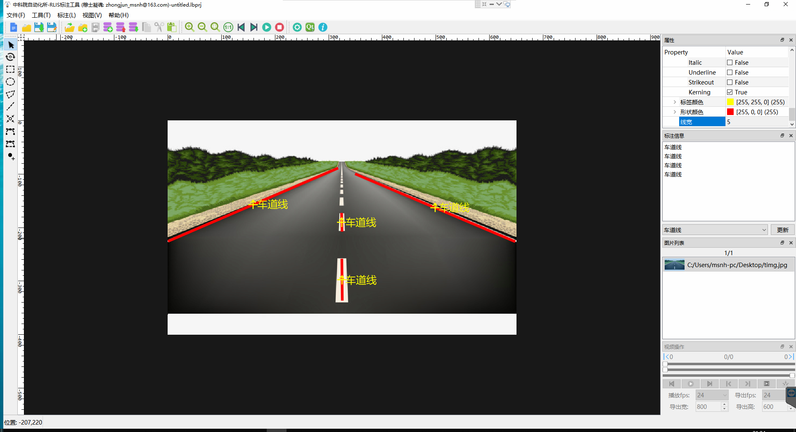
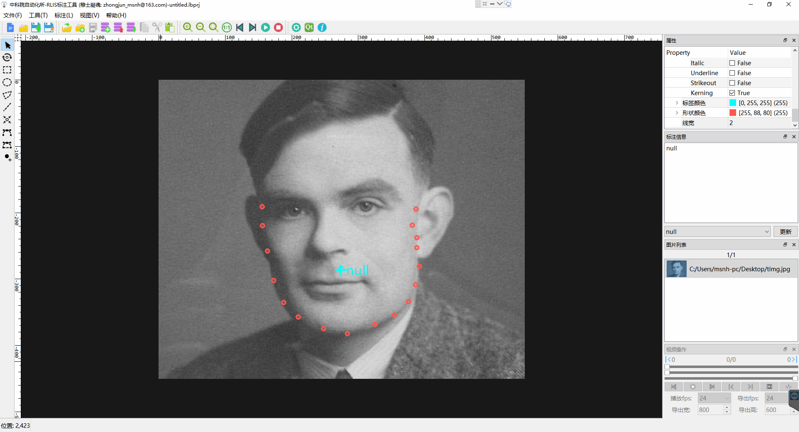
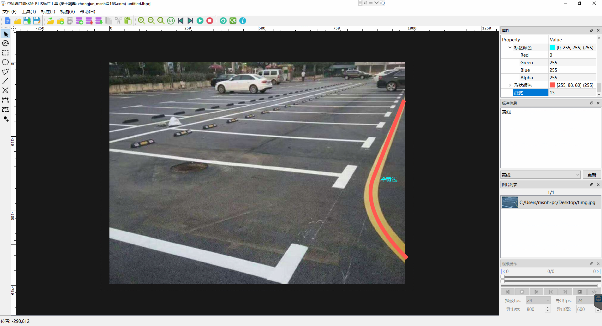
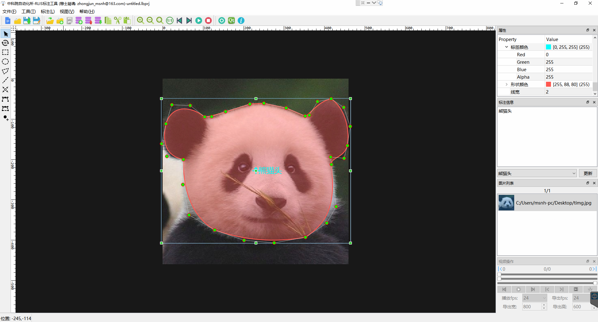
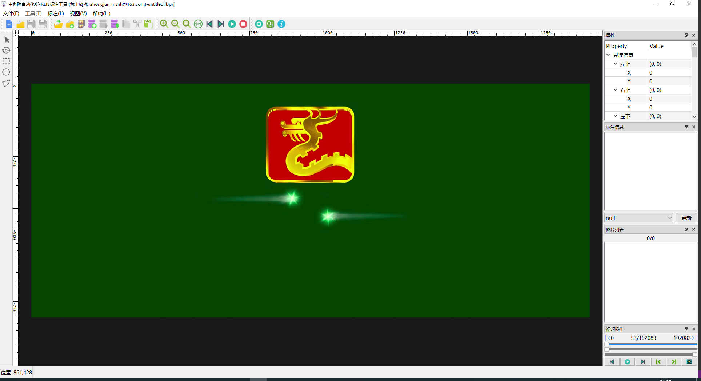

# CASIA标注工具 (可以watch这个仓库,更新后可第一时间知晓)
---
### 软件介绍
CasiaLabeler是一款非常轻量的标注软件，支持win10、ubuntu18和mac10.13+平台。主要适用于目标检测和实例分割等场景。可用于Faster RCNN, Mask RCNN, Yolo系列, SSD系列, Centernet系列等。
### 说明
你可以免费使用本软件，但不可用于任何商业用途(©2020 Casia RLIS)，仅供学习科研使用。如有BUG，可以在issue里面进行评论，虽然我也不一定会立即修复BUG(**只有晚上才有时间啦~**），不过有时间的了还是会修复的。如果觉得好用，欢迎star。
### 更新
2020/06/08 21:00  
新增显示 **多边形标注**， **多边形标注**，**点标注**，**曲线标注**，**贝塞尔区域标注** 对应点的编号 Ctrl+H。

2020/06/13 20:00  
新增mac版本, mac10.13+。

### 视频介绍
B站: https://www.bilibili.com/video/BV1dA411b7F4/
### 加载不出图像，去CSDN.
CSDN: https://blog.csdn.net/MSNH2012/article/details/105693120
### 概览

### 特点
- **1. 支持图片格式**

  png,jpg,jpeg,bmp

  **注：** 单次标注不能超过200张
- **2. 支持视频格式**

  avi,mp4,wmv,mov,asf
  
  **注：** 上述视频格式, 如压缩, 请采用H.264编码视频，或无压缩视频。
- **3. 支持标注框复制粘贴**
- **4. 支持标注种类**

  矩形, 多边形, 线段, 点, 贝塞尔曲线, 贝塞尔区域  
- **5. 导出格式** 
 
 **4点矩形格式(多边形类似):**  图片路径 [空格] x1,y1,x2,y2,x3,y3,x4,y4,标签 [空格] ...  
  
 **xywhθ矩形格式:**  图片路径 [空格] x,y,w,h,θ,标签 [空格] ...  
 符合该格式的标注文档，同样可导入本软件。 
 如果想要COCO，Labelme等支持的格式，用python转换一下就行啦~ 
 - **6. 支持平台**
  支持windows10、ubuntu1804+、Mac10.13+.
- **7. 特殊说明**
 工程路径中不能带有空格！
### 快捷键
- 绘制矩形: D 
- 绘制多边形: p 
- 绘制线段: L 
- 绘制点: T 
- 绘制贝塞尔曲线: B 
- 绘制贝塞尔区域: Alt+B 
- 插入点: Alt+T 
- 旋转图形: R 
- 新建工程: Ctrl+N 
- 打开工程: Ctrl+O 
- 保存工程: Ctrl+S 
- 另存为工程: Ctrl+Shift+S 
- 复制图形: Ctrl+C 
- 剪切图形: Ctrl+X 
- 粘贴图形: Ctrl+V 
- 移动图形: ←↑→↓ 
- 上一张: Ctrl+Space 
- 下一张: Ctrl+Shift+Space 
- 适应窗口: Ctrl+F 
- 1:1显示: Ctrl+1 
- 删除点: 右键 
- 显示序号: Ctrl+H
### 示例
- **1.添加和导入标签**

- **2.矩形标注**

- **3.带角度标注**

- **4.多边形标注**

- **5.直线标注**

- **6.点标注**

- **7.曲线标注**

- **8.贝塞尔区域标注**

- **9.视频操作**

- **10.设置相关**

- ### 下载地址
链接: https://pan.baidu.com/s/1Gjxx3-pbhC_UruJ0j5dLXQ  密码: p2ek
