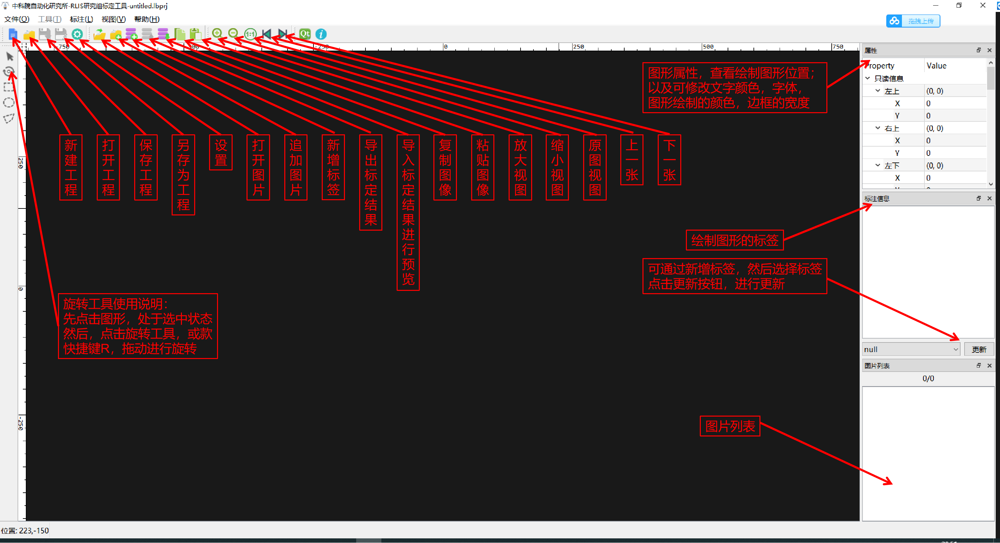
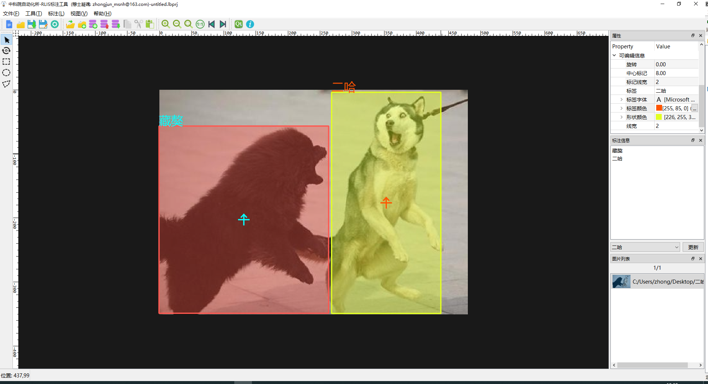
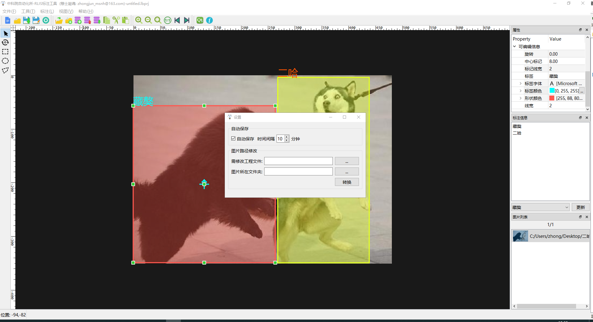

# CASIA标注工具
---
### 首先大家最关心的，下载地址
链接：https://pan.baidu.com/s/1MLT8QkFth8UVhHlmbopXfQ 
提取码：2v7n
- 有图文介绍,加载不出来去CSDN把 https://blog.csdn.net/MSNH2012/article/details/105693120
### 说明
你可以免费使用本软件，但不可用于商业用途，仅供学习科研使用。如有BUG，可以通过zhongjun_msnh@163.com发给我，虽然我也不一定会立即修复BUG，不过有时间的了还是会修复的。如果有啥新功能，也可以e-mail me。如果觉得好用，给个小星星呗，不给也OK啦。
### 概览

### 特点
- **1.添加和导入标签**

- **2.矩形标注**

- **3.带角度标注**

- **4.多边形标注**

- **5.设置相关**

### 支持平台
- 支持windows和ubuntu
### 导出格式
- 支持的导出格式 

- **图片路径 [空格] x1,y1,x2,y2,x3,y3,x4,y4,标签 [空格] ...**
- 符合该格式的标注文档，同样可导入本软件。
- 如果想要COCO，Labelme等支持的格式，用python转换一下就行啦~
### 特殊说明
- 工程路径中不能带有空格！
